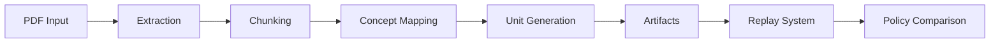

# Adaptive Textbook Helper

A CLI tool that transforms SQL textbooks from PDFs into structured instructional units (L1-L4 hints, explanations, worked examples) for adaptive learning systems, using local Ollama LLMs and grounded extraction pipelines.

## Adaptive Integration (Primary Path)

The canonical output for the adaptive app is a **textbook-static corpus** built
from both raw PDFs.  One command handles indexing, merging, and validation:

```bash
# Build merged textbook-static corpus for both PDFs
./scripts/build_textbook_static.sh [OUTPUT_DIR]
# default output: ./output/textbook-static/
```

This produces:

```text
output/textbook-static/
├── textbook-manifest.json   ← schema-v1, both sourceDocIds
├── concept-map.json         ← merged, namespaced by docId
├── chunks-metadata.json
└── concepts/
    ├── <murach-docId>/      ← one .md per concept
    └── <ramakrishnan-docId>/
```

Verify at any time with:

```bash
python -m algl_pdf_helper validate-handoff output/textbook-static/
```

### Learner-facing content quality gate

Exported concept files are automatically audited for learner-facing quality
during every export.  Each unit in `textbook-units.json` carries four quality
fields:

| Field | Values | Meaning |
|-------|--------|---------|
| `readabilityStatus` | `ok` \| `fallback_only` | `ok` — safe to show; `fallback_only` — explanation is too corrupted to display as-is |
| `readabilityWarnings` | `list[str]` | Diagnostic reasons for the verdict (empty when `ok`) |
| `exampleQuality` | `valid` \| `filtered` \| `hidden` | `valid` — SQL examples usable; `filtered` — examples have prose debris; `hidden` — no usable examples |
| `learnerSafeSummary` | `str` | Always-safe fallback: `"{title}: {definition}"` — present even when status is `fallback_only` |

**Detection rules (deterministic, no LLM):**

| Check | Trigger | Outcome |
|-------|---------|---------|
| `garble_density` | > 0.8 % of explanation chars are OCR artefacts (`&c;`, `h&c;h`, …) | `fallback_only` |
| `semantic_drift` | < 15 % of title keywords appear in explanation body | `fallback_only` |
| `toc_pollution` | ≥ 3 TOC-like patterns (`Chapter N`, `page NN`, …) in explanation | `fallback_only` |
| `marketing_boilerplate` | ≥ 2 publisher phrases (`ISBN`, `All rights reserved`, …) | `fallback_only` |
| `ui_artifact_density` | > 1 % of explanation chars are block/checkbox Unicode (`►`, `□`, `■`, `E2I`…) | `fallback_only` |
| `structural_corruption` | ≥ 2 garbled structural markers (`Cliapter`, `develop,nent`, …) | `fallback_only` |
| `duplication` | > 40 % of explanation sentences are repeated | warning only |
| `sql_contamination` | > 50 % of SQL code blocks contain embedded English prose | `exampleQuality: filtered` |
| `thin_explanation` | < 40 words in explanation | warning only |
| No SQL blocks present | — | `exampleQuality: hidden` |

The two newest rules (`ui_artifact_density`, `structural_corruption`) catch **borderline degraded** concepts that pass garble/drift/TOC checks because the OCR content shares some keywords with the concept title but was extracted from a screenshot page or chapter navigation page.

`validate-handoff` reports the quality distribution:

```text
  Learner quality      : 52 ok, 18 fallback_only (26% fallback)
```

If quality fields are absent from an older export, `validate-handoff` prints a
warning and asks you to re-run the build.

#### Example Quality Expectations

The `exampleQuality` field indicates the usability of SQL examples extracted for learner consumption:

| State | Meaning | When to Use |
|-------|---------|-------------|
| `valid` | SQL examples passed all validation checks | Examples are prose-free, have no OCR corruption, and have valid SQL structure |
| `filtered` | SQL examples contain prose contamination or OCR artifacts but are still extractable | Examples have some noise but core SQL is usable with caution |
| `hidden` | No usable SQL examples found | Either no examples existed in source or all were filtered out due to corruption |

**Validation Pipeline**

SQL examples undergo multi-layer validation in `extract_learner_safe_sql_blocks()`:

1. **Prose contamination detection** — Blocks with >40% English function words (the, and, is, of, etc.) are flagged as contaminated
2. **OCR corruption detection** — Garbled tokens (e.g., `se1ec`, `fr@m`) and punctuation inside words trigger filtering
3. **Navigation/index text filtering** — TOC entries, chapter references, and page numbers are excluded
4. **SQL structure validation** — Examples must start with valid SQL keywords (SELECT, INSERT, UPDATE, DELETE, CREATE, ALTER, DROP, WITH, etc.)
5. **Minimum complexity check** — Examples must have ≥3 tokens to be considered meaningful
6. **Clause structure validation** — Multi-word SQL constructs must be properly formed

**Quality Targets**

- At least 50% of fallback concepts should have some form of examples (`valid` + `filtered`)
- Valid examples are preferred over filtered (aim for >80% of examples to be `valid`)
- Empty arrays are exported when no examples survive (never export corrupted examples)

`validate-handoff` reports the detailed breakdown:

```text
  Fallback example quality: 2 valid, 4 filtered, 37 hidden
```

### Concept-level quality index (`concept-quality.json`)

The export pipeline also writes a standalone **`concept-quality.json`** keyed
by namespaced concept ID.  The adaptive app loads this file once at startup
and performs O(1) quality lookups without scanning `textbook-units.json`.

```text
output/textbook-static/
└── concept-quality.json   ← NEW: concept-level quality lookup index
```

**Schema (`concept-quality-v1`):**

```json
{
  "schemaVersion": "concept-quality-v1",
  "generatedAt": "2025-…",
  "sourceDocIds": ["murachs-mysql-3rd-edition", "dbms-ramakrishnan-3rd-edition"],
  "totalConcepts": 70,
  "qualityByConcept": {
    "dbms-ramakrishnan-3rd-edition/1nf": {
      "readabilityStatus": "fallback_only",
      "readabilityWarnings": ["garble_density=0.021 …"],
      "exampleQuality": "filtered",
      "learnerSafeSummary": "First Normal Form (1NF): Eliminating repeating groups…",
      "learnerSafeKeyPoints": [
        "First Normal Form (1NF) refers to: Eliminating repeating groups",
        "Key topics: normalization, 1nf",
        "Textbook covers: definition, worked examples",
        "Related concepts: 2nf, 3nf",
        "Source: pages 145–162"
      ],
      "learnerSafeExamples": [
        {"title": "SQL Example 1", "sql": "CREATE TABLE employees (id INT PRIMARY KEY, …);"}
      ]
    },
    "murachs-mysql-3rd-edition/select-basic": {
      "readabilityStatus": "ok",
      "readabilityWarnings": [],
      "exampleQuality": "valid",
      "learnerSafeSummary": "Select Statement: Retrieve rows from a table",
      "learnerSafeKeyPoints": [
        "Select Statement refers to: Retrieve rows from a table",
        "Key topics: select, query, dml",
        "Source: page 89"
      ],
      "learnerSafeExamples": [
        {"title": "SQL Example 1", "sql": "SELECT * FROM vendors;"}
      ]
    }
  }
}
```

| Field | Type | Description |
|-------|------|-------------|
| `readabilityStatus` | `string` | `ok` or `fallback_only` — whether the raw explanation is safe to display |
| `readabilityWarnings` | `string[]` | Diagnostic reasons when status is `fallback_only` |
| `exampleQuality` | `string` | `valid`, `filtered`, or `hidden` — SQL example usability |
| `learnerSafeSummary` | `string` | Always-safe fallback: `"{title}: {definition}"` |
| `learnerSafeKeyPoints` | `string[]` | Structured bullet points from metadata (title, keywords, sections, related concepts, page span) |
| `learnerSafeExamples` | `object[]` | Clean SQL code blocks extracted from markdown (up to 3), each with `title` and `sql` fields |

**How the adaptive app should consume this:**

```ts
// Load once at startup
const conceptQuality = await fetch('/textbook-static/concept-quality.json').then(r => r.json());

// On concept page render
const quality = conceptQuality.qualityByConcept[namespacedConceptId];
if (quality?.readabilityStatus === 'fallback_only') {
  // Use structured key points for richer fallback UI
  renderFallback({
    summary: quality.learnerSafeSummary,
    keyPoints: quality.learnerSafeKeyPoints,      // bullet points from metadata
    examples: quality.learnerSafeExamples,        // clean SQL code blocks (if any)
  });
} else {
  renderFullExplanation(concept.markdownPath, quality?.exampleQuality);
}
```

Keys in `qualityByConcept` are identical to the namespaced IDs in
`concept-map.json`, so no transformation is required.

**How adaptive should interpret each quality status:**

| Status / Field | Adaptive behaviour |
| -------------- | ------------------ |
| `readabilityStatus: ok` | Show full markdown explanation and examples. Safe for learners. |
| `readabilityStatus: fallback_only` | **Do not show the raw explanation.** Render `learnerSafeSummary` instead (always a clean `"Title: definition"` string). Optionally show a banner: "Full explanation unavailable for this concept." |
| `exampleQuality: valid` | SQL examples are clean. Render them normally. |
| `exampleQuality: filtered` | SQL code blocks contain embedded prose. Either skip examples entirely or show them with a caveat banner ("Examples may contain formatting issues"). |
| `exampleQuality: hidden` | No SQL examples were extracted. Do not show an empty examples section. |

### Fallback enrichment coverage guarantees

When concepts are marked `fallback_only`, the pipeline extracts structured metadata
to ensure learners still receive useful context. `validate-handoff` enforces
coverage thresholds:

| Metric                    | Threshold | Meaning                                                                                                      |
|---------------------------|-----------|--------------------------------------------------------------------------------------------------------------|
| **Key points coverage**   | ≥ 80%     | Fallback concepts with `learnerSafeKeyPoints` array present                                                  |
| **Examples coverage**     | ≥ 50%     | Fallback concepts with `learnerSafeExamples` array present (only counted when `exampleQuality` is `valid` or `filtered`) |

If coverage falls below these thresholds, `validate-handoff` prints a warning
but still exits 0 (the bundle is valid but may provide a degraded learner
experience). CI can treat the warning as a failure if desired.

`validate-handoff` checks that:
- `concept-quality.json` exists and parses
- every key in it appears in `concept-map.json` (no orphans)
- every `concept-map.json` key is covered (no gaps)
- field values are from the allowed sets

Run the dedicated tests:

```bash
PYTHONPATH=src python -m pytest tests/test_learner_quality_audit.py -v
```

### Build → Validate → Report → Sync runbook

Complete sequence to produce a sync-ready bundle and hand it off to the adaptive app:

```bash
# 1. Build — index both PDFs and produce the merged corpus
PYTHONPATH=src ./scripts/build_textbook_static.sh ./output/textbook-static

# 2. Validate — confirm the bundle is complete and internally consistent
PYTHONPATH=src python -m algl_pdf_helper validate-handoff ./output/textbook-static
```

Expected `validate-handoff` output:

```text
Validating: ./output/textbook-static
  Concept-map entries  : 70
  Markdown files        : 70
  Textbook units         : 70
  Concept-quality keys   : 70
  Source docs (manifest) : 2
  Doc directories        : 2
  chunks-metadata docIds : ['dbms-ramakrishnan-3rd-edition', 'murachs-mysql-3rd-edition']
  Per-source-doc summary:
    dbms-ramakrishnan-3rd-edition: 35 concepts, 35 units
    murachs-mysql-3rd-edition: 35 concepts, 35 units
  Learner quality        : 28 ok, 42 fallback_only (60% fallback)
  Fallback enrichment    : 38 / 42 have learnerSafeKeyPoints (90%)
  Fallback examples      : 25 / 35 have learnerSafeExamples (71%)
  Key points coverage    : 90% (threshold: 80%)
  Examples coverage      : 71% (threshold: 50%)

✅ Handoff integrity: VALID
```

The bundle is ready for direct sync when `validate-handoff` exits 0 and prints `VALID`.

```bash
# 3. Report — generate student learning quality summary
PYTHONPATH=src python scripts/report_student_learning_quality.py ./output/textbook-static
```

```bash
# 4. Sync — copy the bundle into the adaptive app's public directory
#    (adjust DST to your adaptive app's static asset path)
DST=../adaptive-app/public/textbook-static
rsync -av --delete ./output/textbook-static/ "$DST/"
```

The adaptive app consumes the bundle as-is — no transformation required.
Files that must be present before the sync script is run:

| File | Consumed by |
| ---- | ----------- |
| `concept-map.json` | concept browser, navigation |
| `textbook-manifest.json` | startup: verifies bundle version |
| `chunks-metadata.json` | search / chunk lookup |
| `textbook-units.json` | unit renderer, sequencing |
| `concept-quality.json` | quality gate before rendering |
| `concepts/<docId>/*.md` | individual concept pages |

```bash
# 5. Smoke-test the bundle (no PDFs required once output/ exists)
PYTHONPATH=src python -m pytest tests/test_adaptive_handoff_smoke.py -v
```

### Smoke gate (CI verification)

A single pytest command proves the entire producer path — static structure,
preflight routing, merge behaviour, and artifact integrity — in one shot:

```bash
PYTHONPATH=src python -m pytest tests/test_adaptive_handoff_smoke.py -v
```

The gate is split into three tiers:

| Tier | What it checks | Requires |
| --- | --- | --- |
| **Static** | `build_textbook_static.sh` exists, no `/Users/…` hard-codes, `validate-handoff` CLI registered, `determine_strategy()` uses EMBEDDED_TEXT_OCR_FLOOR, merge logic present | nothing (always runs) |
| **Preflight** | Both real PDFs route to `direct` (not OCR) | `raw_pdf/` present |
| **Artifact** | All 4 output files exist, `docCount==2`, both `sourceDocs`, concept `.md` files resolve, `validate-handoff` exits 0 | `output/textbook-static/` present |

The static tier would **fail** on the old uploaded-zip state (missing script,
wrong routing, absent merge code) and **pass** only on the corrected snapshot.

---

## Demo

```bash
# Process a PDF with Ollama repair (default)
python -m algl_pdf_helper process raw_pdf/sample.pdf --output-dir outputs/demo

# Skip LLM for fast extraction-only run
python -m algl_pdf_helper process raw_pdf/sample.pdf --output-dir outputs/demo --skip-llm

# Replay synthetic traces under different policies
python -m algl_pdf_helper replay tests/fixtures/traces --output-dir outputs/replay
```

## Features

### Implemented (v1.0)

- **PDF Processing Pipeline**: Extracts text, chunks, maps concepts, generates instructional units
- **Ollama-First Defaults**: Local LLM repair for weak L3 content (default: `qwen3.5:9b-q8_0`)
- **Canonical Artifacts**: `extraction_report.json`, `llm_interventions.json`, `concept_units.json`, `quality_report.json`
- **Educational Commands**: `edu status`, `edu generate`, `edu cost`
- **Replay System**: Replay learner traces under 3 escalation policies (fast/slow/adaptive)
- **SQL-Engage Backbone**: 50 SQL concepts, 59 prerequisite edges, 29 error subtypes
- **HintWise Adapter**: Contract for hint eligibility payloads (`hintwise_adapter.py`)
- **HintWise HTTP Client**: Live endpoint integration with env-var config, auth header, timeout, and one-retry policy (`hintwise_client.py`)
- **HintWise Service Layer**: Full roundtrip — payload → HTTP call → normalized result → `hintwise-results.jsonl` with provenance (`hintwise_service.py`)
- **HintWise CLI**: `hintwise` subcommand for offline dry-runs and live endpoint calls
- **Learner Textbook Assembly**: Personal textbooks from concept units + learner events

### Planned (v2.0)

- Real learner trace ingestion (not synthetic)
- Online bandit policy adaptation
- Marker PDF extraction backend
- Full adaptive web app UI

## Architecture

The pipeline follows a 5-phase flow:

1. **Extraction** (pymupdf → text pages)
2. **Cleaning** (normalize, strip headers)
3. **Chunking** (word-based chunks with overlap)
4. **Concept Mapping** (SQL ontology → chunks)
5. **Unit Generation** (L1-L4 instructional units with Ollama repair)

Data flows: `PDF → chunks → concepts → units → artifacts`. The replay layer simulates policy decisions on learner traces without live integration.



## Setup

### Prerequisites

- Python 3.10+
- Ollama server running locally (default: `http://localhost:11434`)
- Recommended model: `qwen3.5:9b-q8_0`

### Quick Start

```bash
# Create virtual environment
python -m venv .venv
source .venv/bin/activate  # or .venv\Scripts\activate on Windows

# Install with unit library support
pip install -e '.[unit]'

# Verify Ollama is available
python -m algl_pdf_helper edu status

# Process a PDF
python -m algl_pdf_helper process raw_pdf/sample.pdf --output-dir ./output
```

### Run Tests

```bash
# Core contract tests (fast)
pytest tests/test_artifact_contracts.py tests/test_day3_contracts.py tests/test_replay_system.py -q

# Full suite (includes integration tests that may timeout without Ollama)
pytest -q
```

### Configuration

| Environment Variable | Purpose | Default |
|---------------------|---------|---------|
| `OLLAMA_HOST` | Ollama server URL | `http://localhost:11434` |
| `OLLAMA_MODEL` | Ollama model name | `qwen3.5:9b-q8_0` |
| `ALGL_LLM_PROVIDER` | Override default provider | `ollama` |
| `HINTWISE_BASE_URL` | HintWise service base URL (unset = offline mode) | _(unset)_ |
| `HINTWISE_ENDPOINT` | HintWise endpoint path | `/api/hint` |
| `HINTWISE_API_KEY` | Bearer token for HintWise auth (optional) | _(unset)_ |
| `HINTWISE_TIMEOUT` | Request timeout in seconds | `10` |

## API Reference

### CLI Commands

| Command | Description |
|---------|-------------|
| `process` | Process PDF into unit library with artifacts |
| `edu` | Educational note generation (`status`, `generate`, `cost`) |
| `replay` | Replay traces under policies for comparison |
| `index` | Build PDF index to textbook-static format |
| `validate` | Validate an existing unit library |
| `inspect` | Inspect units for a specific concept |
| `cache` | Manage Ollama repair cache |
| `hintwise` | Build HintWise payload from artifact; call live endpoint if configured |

### Key Options for `process`

| Option | Description |
|--------|-------------|
| `--output-dir, -o` | Output directory (required) |
| `--skip-llm` | Skip all LLM-based processing |
| `--llm-provider` | LLM provider: `ollama` (default), `grounded`, `kimi`, `openai` |
| `--ollama-model` | Ollama model for repair |
| `--use-ollama-repair` | Enable Ollama repair for weak L3 content (default: on) |
| `--filter-level` | `strict`, `production` (default), or `development` |
| `--export-mode` | `prototype` (default) or `student_ready` |

## Data Model / Schema

### Core Artifacts (process command)

- `extraction_report.json` - Extraction method, page counts, quality metrics
- `llm_interventions.json` - LLM repair calls, success/failure tracking
- `concept_units.json` - Generated units with provenance metadata
- `quality_report.json` - Content quality analysis, pass/fail status

### Replay Artifacts

- `replay_summary.json` / `replay_summary.csv` - Run metadata, policy metrics
- `per_learner_metrics.csv` - Per-learner HDI, CSI, APS scores
- `policy_comparison.csv` - Cross-policy comparison statistics

### Backbone Files

- `sql_engage_backbone.json` - 50 SQL concepts, prerequisite edges, practice map
- `learner_textbook.json` - Personal textbook with saved units and mastery

See [docs/schema-reference.md](docs/schema-reference.md) for detailed field documentation.

## Trade-offs & Design Decisions

**Chose:** Ollama as default LLM provider with local-first operation.
**Gave up:** Cloud LLM convenience and higher throughput.
**Why:** Enables air-gapped operation, reduces API costs, and keeps learner data local by default.

**Chose:** Synthetic trace fixtures for replay testing.
**Gave up:** Real learner data coverage.
**Why:** No live adaptive system is in production; fixtures provide deterministic policy comparison without data privacy concerns.

**Chose:** Separate backbone adapter over direct integration.
**Gave up:** Tight coupling with SQL-Engage service.
**Why:** The PDF helper operates as a standalone pipeline; explicit adapter contracts allow future HTTP integration without refactoring.

## Limitations

1. **Integration Tests Timeout**: `test_process_command_creates_units` and `test_end_to_end_pipeline` may timeout in CI without Ollama running locally with the expected model.

2. **OCR Fallback**: GLM-OCR integration attempts Ollama vision but may fail with 500 errors if models are not loaded.

3. **Unit Generation on Weak Slices**: Test PDF slices with minimal SQL content may produce 0 instructional units (expected behavior).

4. **No Live Bandit**: The replay system computes metrics deterministically; online policy adaptation is not implemented.

5. **Synthetic Data Only**: All learner traces in fixtures are synthetic; no real learner data is included.

See [docs/final-verification.md](docs/final-verification.md) for current test status.

## HintWise Quick Start

### Offline inspection (no endpoint needed)

```bash
# Inspect payload for a concept — no HTTP call
python -m algl_pdf_helper hintwise ./output/concept_units.json \
    --concept select-basic --dry-run
```

### Live endpoint call

```bash
export HINTWISE_BASE_URL=http://localhost:8080
export HINTWISE_API_KEY=my-token   # optional

python -m algl_pdf_helper hintwise ./output/concept_units.json \
    --concept select-basic \
    --learner-id learner_001 \
    --problem-id prob_01 \
    --escalation-level L2 \
    --output-dir ./outputs/hints/
# → appends one record to ./outputs/hints/hintwise-results.jsonl
```

### Smoke test (mocked, offline)

```bash
PYTHONPATH=src pytest tests/test_hintwise_client.py tests/test_hintwise_integration.py -q
```

## Next Steps

- [ ] Implement real learner trace ingestion endpoint
- [ ] Add online bandit update loop for policy learning
- [ ] Expand SQL concept ontology beyond 50 core concepts
- [ ] Add production monitoring for Ollama repair success rates

---

*For detailed pipeline documentation, see [docs/ollama-pipeline.md](docs/ollama-pipeline.md) and [docs/replay-evaluation.md](docs/replay-evaluation.md).*
