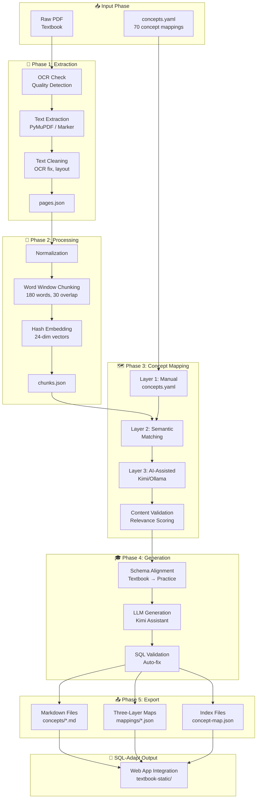

# PDF Processing Pipeline Diagram

## Overview

This document shows the complete flow from raw PDF to SQL-Adapt compatible output for the `algl-pdf-helper` project.

---

## High-Level Flow

```
┌─────────────┐    ┌─────────────┐    ┌─────────────┐    ┌─────────────┐
│  Raw PDF    │───▶│   Phase 1   │───▶│   Phase 2   │───▶│   Phase 3   │
│  (Input)    │    │   Extract   │    │   Process   │    │  Concepts   │
└─────────────┘    └─────────────┘    └─────────────┘    └─────────────┘
                                                              │
                                                              ▼
┌─────────────┐    ┌─────────────┐                    ┌─────────────┐
│  SQL-Adapt  │◀───│   Phase 5   │◀───────────────────│   Phase 4   │
│   Output    │    │   Export    │                    │   Generate  │
└─────────────┘    └─────────────┘                    └─────────────┘
```

---

## Detailed Pipeline

### Phase 1: PDF Extraction & OCR

```
┌─────────────────────────────────────────────────────────────────┐
│                    PHASE 1: PDF EXTRACTION                       │
└─────────────────────────────────────────────────────────────────┘

Raw PDF Input
      │
      ▼
┌─────────────────┐
│  OCR Check      │◄─── Quality detection (PyMuPDF sample)
│  (Quality Test) │      Character count > 800 = good
└────────┬────────┘
         │
    ┌────┴────┐
    │         │
    ▼         ▼
┌────────┐  ┌─────────────┐
│  OCR   │  │ Direct Text │
│ Needed │  │ Extraction  │
└───┬────┘  └──────┬──────┘
    │              │
    ▼              │
┌──────────────────────────┐
│  ocrmypdf + Tesseract    │
│  (if OCR needed)         │
│  • deskew                │
│  • text recognition      │
└──────────┬───────────────┘
           │
           ▼
┌──────────────────────────┐
│  Marker / PyMuPDF        │
│  (High-quality extraction)│
│  • Layout preservation   │
│  • Per-page chunks       │
└──────────┬───────────────┘
           │
           ▼
┌──────────────────────────┐
│  Text Cleaning           │
│  (TextCleaner class)     │
│  • Fix OCR errors        │
│  • Remove headers/footers│
│  • Fix 2-column layout   │
└──────────┬───────────────┘
           │
           ▼
     [RAW PAGE OBJECTS]
           │
           ▼
    ┌──────────────────┐
    │ pages.json       │
    │ [{              │
    │   page_number: 1 │
    │   text: "..."    │
    │   sections: []   │
    │ }]               │
    └──────────────────┘
```

**Key Components:**
- `extract.py` - PyMuPDF extraction, quality detection
- `extract_marker.py` - Marker high-quality extraction
- `clean.py` - Text cleaning and normalization

---

### Phase 2: Chunking & Embedding

```
┌─────────────────────────────────────────────────────────────────┐
│              PHASE 2: PROCESSING & CHUNKING                      │
└─────────────────────────────────────────────────────────────────┘

Raw Text (from Phase 1)
      │
      ▼
┌──────────────────────────┐
│  Text Normalization      │
│  • Fix encoding issues   │
│  • Standardize whitespace│
└──────────┬───────────────┘
           │
           ▼
┌──────────────────────────┐
│  Word Window Chunking    │
│  (chunker.py)            │
│  • 180 words per chunk   │
│  • 30 word overlap       │
│  • Preserve page info    │
└──────────┬───────────────┘
           │
           ▼
┌──────────────────────────┐
│  Hash Embedding          │
│  (embedding.py)          │
│  • 24-dim vectors        │
│  • Local, deterministic  │
│  • No external API       │
└──────────┬───────────────┘
           │
           ▼
┌──────────────────────────┐
│  Chunk Objects           │
│  {                       │
│    chunkId: "doc:p1:c1"  │
│    page: 1,              │
│    text: "...",          │
│    embedding: [0.1, ...] │
│  }                       │
└──────────┬───────────────┘
           │
           ▼
     [CHUNKS OUTPUT]
           │
           ▼
    ┌──────────────────┐
    │ chunks.json      │
    └──────────────────┘
```

**Key Components:**
- `chunker.py` - Word window chunking with overlap
- `embedding.py` - Hash-based 24-dim embeddings

---

### Phase 3: Concept Mapping (Three-Layer System)

```
┌─────────────────────────────────────────────────────────────────┐
│       PHASE 3: CONCEPT MAPPING & VALIDATION                      │
└─────────────────────────────────────────────────────────────────┘

Chunks (from Phase 2)
      │
      ▼
┌──────────────────────────────────────────────────────────┐
│              CONCEPT MAPPING SYSTEM                       │
│  (concept_mapping_system.py)                             │
│  Three-layer approach:                                   │
└──────────────────────────────────────────────────────────┘
      │
      ├── Layer 1: Manual Mapping (concepts.yaml)
      │   • Define concepts and page ranges
      │   • Human-curated mappings
      │   • 70 concepts (2 textbooks)
      │
      ├── Layer 2: Semantic Matching
      │   • Match chunks to concepts
      │   • Content validation
      │   • Relevance scoring
      │
      └── Layer 3: AI-Assisted (Kimi/Ollama)
          • Extract relevant passages
          • Validate relevance
          • Generate educational content
          ▼
┌──────────────────────────┐
│  Content Validation      │
│  (ContentValidator)      │
│  • SQL keyword detection │
│  • Non-SQL filtering     │
│  • Relevance scoring     │
│                          │
│  Score = (SQL_kw × 0.3)  │
│       + (match × 0.5)    │
│       - (penalty × 0.2)  │
└──────────┬───────────────┘
           │
           ▼
     [CONCEPT OBJECTS]
           │
           ▼
    ┌──────────────────┐
    │ concept-manifest │
    │ .json            │
    └──────────────────┘
```

**Key Components:**
- `concept_mapping_system.py` - Three-layer concept mapping
- `concepts.yaml` - 70 concept definitions with page ranges
- `ContentValidator` - Relevance scoring and filtering

---

### Phase 4: Pedagogical Generation

```
┌─────────────────────────────────────────────────────────────────┐
│           PHASE 4: PEDAGOGICAL CONTENT GENERATION                │
│     (NEW: pedagogical_generator.py + kimi_assistant.py)         │
└─────────────────────────────────────────────────────────────────┘

Concept Objects (from Phase 3)
      │
      ▼
┌──────────────────────────┐
│  Schema Alignment        │
│  (PedagogicalGenerator)  │
│                          │
│  Textbook → Practice     │
│  ┌────────────────────┐  │
│  │ Sailors  → users   │  │
│  │ Boats    → products│  │
│  │ Reserves → orders  │  │
│  │ Staff    → employees│ │
│  │ Vendors  → users   │  │
│  └────────────────────┘  │
└──────────┬───────────────┘
           │
           ▼
┌──────────────────────────┐
│  LLM Content Generation  │
│  (Kimi Assistant)        │
│                          │
│  • Definition            │
│  • Detailed explanation  │
│  • 2-3 SQL examples      │
│  • Common mistakes       │
│  • Practice questions    │
└──────────┬───────────────┘
           │
           ▼
┌──────────────────────────┐
│  SQL Validation          │
│  (SQLValidator)          │
│                          │
│  Checks:                 │
│  • has_SELECT            │
│  • has_FROM              │
│  • has_semicolon         │
│                          │
│  Auto-fixes:             │
│  • Add missing clauses   │
│  • Capitalize keywords   │
└──────────┬───────────────┘
           │
           ▼
┌──────────────────────────┐
│  Practice Problem Links  │
│  • Connect to SQL-Adapt  │
│    problem IDs           │
│  • e.g., problem-3,      │
│    problem-4             │
└──────────┬───────────────┘
           │
           ▼
     [EDUCATIONAL NOTES]
           │
           ▼
    ┌──────────────────┐
    │ {doc-id}-edu-    │
    │ cational-notes   │
    │ .json            │
    └──────────────────┘
```

**Key Components:**
- `pedagogical_generator.py` - Schema mapping, content transformation
- `kimi_assistant.py` - LLM interaction for content generation
- `educational_pipeline.py` - SQL validation and orchestration

---

### Phase 5: Output Generation & Export

```
┌─────────────────────────────────────────────────────────────────┐
│                  PHASE 5: OUTPUT GENERATION                      │
└─────────────────────────────────────────────────────────────────┘

Educational Notes (from Phase 4)
      │
      ├──▶┌──────────────────────────┐
      │   │  Markdown Generator      │
      │   │  (markdown_generator.py) │
      │   │  • Format as .md         │
      │   │  • Add syntax highlighting│
      │   │  • Create tables         │
      │   └──────────┬───────────────┘
      │              │
      │              ▼
      │        concepts/{doc_id}/*.md
      │        • README.md (index)
      │        • select-basic.md
      │        • joins-intro.md
      │        • aggregation.md
      │
      ├──▶┌──────────────────────────┐
      │   │  Three-Layer Mapping     │
      │   │  Files                   │
      │   └──────────┬───────────────┘
      │              │
      │              ▼
      │        mappings/
      │        ├── error-subtypes.json    (Layer 1)
      │        ├── alignment-map.json     (Layer 2)
      │        └── concept-registry.json  (Layer 3)
      │
      └──▶┌──────────────────────────┐
          │  Index Files             │
          │  (export_sqladapt.py)    │
          └──────────┬───────────────┘
                     │
                     ▼
    ┌──────────────────┬──────────────────┬──────────────────┐
    │ concept-map.json │ {doc-id}-        │ manifest.json    │
    │ • Master index   │ sqladapt.json    │ • Index metadata │
    │ • Chunk IDs      │ • Full export    │ • Source refs    │
    │ • Page refs      │ • All layers     │ • Version info   │
    └──────────────────┴──────────────────┴──────────────────┘
                     │
                     ▼
              ┌──────────────┐
              │ SQL-Adapt    │
              │ Export       │
              └──────────────┘
```

**Key Components:**
- `markdown_generator.py` - Markdown file generation
- `export_sqladapt.py` - SQL-Adapt compatible export
- `indexer.py` - Index file generation

---

## File Flow Diagram

```
algl-pdf-helper/
│
├── raw_pdf/
│   ├── dbms-ramakrishnan-3rd-edition.pdf
│   └── murachs-mysql-3rd-edition.pdf
│
├── read_use/
│   └── {pdf-name}/
│       ├── raw_text/
│       │   └── pages.json            # Phase 1 output
│       │
│       ├── chunks/
│       │   └── chunks.json           # Phase 2 output
│       │
│       ├── concepts/
│       │   └── concept_manifest.json # Phase 3 output
│       │
│       └── pedagogical/              # Phase 4 output
│           └── *.json
│
└── output/
    └── {pdf-name}/
        ├── concept-manifest.json     # Phase 5 output
        ├── concept-map.json          # SQL-Adapt format
        ├── {doc-id}-sqladapt.json    # Full export
        │
        ├── mappings/                 # ⭐ Three-Layer System
        │   ├── error-subtypes.json   # Layer 1: 23 error types
        │   ├── alignment-map.json    # Layer 2: Error → Concept
        │   └── concept-registry.json # Layer 3: Concept metadata
        │
        ├── concepts/{doc_id}/        # ⭐ Concept Content
        │   ├── README.md             # Index
        │   ├── select-basic.md       # Individual concepts
        │   ├── joins-intro.md
        │   └── *.md (30+ files)
        │
        ├── {doc-id}-study-guide.md   # Human-readable
        ├── {doc-id}-extraction.json  # Diagnostic
        └── {doc-id}-educational-notes.json  # Diagnostic
```

---

## SQL-Adapt Integration

```
algl-pdf-helper/output/                    SQL-Adapt/
    │                                            │
    ▼                                            ▼
┌──────────────────┐                    ┌──────────────────────────┐
│ concept-map.json │ ─────────────────▶ │ apps/web/public/         │
│                  │    Copied via      │   textbook-static/       │
│                  │    export script   │   concept-map.json       │
└──────────────────┘                    └──────────────────────────┘
                                              │
┌──────────────────┐                          ▼
│ concepts/*.md    │ ─────────────────▶ ┌──────────────────────────┐
│                  │                    │ textbook-static/         │
│                  │                    │   concepts/*.md          │
└──────────────────┘                    └──────────────────────────┘
                                               │
                                               ▼
                                        ┌──────────────────────────┐
                                        │  Web App Integration     │
                                        │  • AskMyTextbookChat     │
                                        │  • RAG retrieval         │
                                        │  • Concept browsing      │
                                        └──────────────────────────┘
```

---

## Data Transformations

### Input → Output Examples

| Stage | Input | Output | Transformation |
|-------|-------|--------|----------------|
| Phase 1 | Scanned PDF (94MB) | Clean pages (2.4M chars) | OCR + extraction |
| Phase 2 | Raw text | Chunks (~3,000) | Windowing + embedding |
| Phase 3 | Chunks | Validated concepts (70) | Concept mapping |
| Phase 4 | Concepts | Educational notes | LLM generation |
| Phase 5 | Notes | Markdown + JSON | Format + export |

### Content Transformation Example

```
Raw PDF Text (DBMS Textbook):
"SELECT * FROM Sailors s WHERE s.rating > 5;"

↓ Phase 4: Schema Alignment (PedagogicalGenerator)

Generated Example (Practice Schema):
┌─────────────────────────────────────────────┐
│ Example: Find Active Users                  │
│                                             │
│ ```sql                                      │
│ SELECT * FROM users                         │
│ WHERE age > 24;                             │
│ ```                                         │
│                                             │
│ This finds all users older than 24.         │
│ Try it with problem-3 in SQL-Adapt!         │
└─────────────────────────────────────────────┘
```

---

## Key Components Reference

### 1. PDF Extractors
| Component | File | Purpose |
|-----------|------|---------|
| PyMuPDF | `extract.py` | Primary extraction, quality check |
| Marker | `extract_marker.py` | High-quality layout preservation |
| ocrmypdf | OCR pipeline | OCR for scanned PDFs |

### 2. Text Processing
| Component | File | Purpose |
|-----------|------|---------|
| TextCleaner | `educational_pipeline.py` | OCR fix, header/footer removal |
| Chunker | `chunker.py` | Word window chunking |
| Embedding | `embedding.py` | 24-dim hash vectors |

### 3. Concept System
| Component | File | Purpose |
|-----------|------|---------|
| Concept Mapper | `concept_mapping_system.py` | Three-layer mapping |
| Concept Definitions | `concepts.yaml` | 70 concept mappings |
| Content Validator | `educational_pipeline.py` | Relevance scoring |

### 4. Content Generation
| Component | File | Purpose |
|-----------|------|---------|
| Pedagogical Generator | `pedagogical_generator.py` | Schema alignment |
| Kimi Assistant | `kimi_assistant.py` | LLM content generation |
| SQL Validator | `educational_pipeline.py` | SQL syntax validation |

### 5. Output Generation
| Component | File | Purpose |
|-----------|------|---------|
| Markdown Generator | `markdown_generator.py` | .md file generation |
| SQL-Adapt Exporter | `export_sqladapt.py` | SQL-Adapt format |
| Indexer | `indexer.py` | Index file generation |

---

## Usage Flow

```
Developer Workflow:

1. Place PDF in raw_pdf/
   └── Place textbooks (dbms-ramakrishnan-3rd-edition.pdf, etc.)

2. Define concepts in concepts.yaml
   └── Map concepts to page ranges

3. Run: ./start.sh
   └── Select "Process All PDFs"

4. Review output in read_use/{pdf-name}/
   └── Check raw_text/, chunks/, concepts/

5. Run pedagogical generation
   └── ./start.sh → "Generate Educational Notes"
   └── Or: Use Kimi integration for AI-assisted generation

6. Export to SQL-Adapt
   └── ./start.sh → "Export to SQL-Adapt"
   └── Or: Command line export

7. Output appears in SQL-Adapt's textbook-static/
   └── Ready for web app integration
```

---

## Pipeline Comparison

| Aspect | Basic Pipeline | Educational Pipeline | Pedagogical Pipeline (NEW) |
|--------|---------------|----------------------|---------------------------|
| Examples | Raw textbook | Cleaned + validated | Practice-aligned schemas |
| Schemas | Sailors, Boats | Sailors, Boats | users, orders, products |
| Mistakes | None | Basic | Realistic with fixes |
| Practice Links | None | Limited | Direct to problems |
| LLM Provider | Ollama (local) | Ollama | Kimi (cloud) + Ollama |
| Validation | None | Basic SQL check | Full SQL validation |
| Student Value | Low | Medium | High |
| Three-Layer Maps | No | No | Yes (23 error types) |

---

## Mermaid Diagram

For rendering in Markdown viewers that support Mermaid:



---

## ASCII Quick Reference

For terminal/quick viewing:

```
┌─────────────────────────────────────────────────────────────────┐
│              ALGL-PDF-HELPER PIPELINE                           │
└─────────────────────────────────────────────────────────────────┘

Input                    Processing                  Output
───────────────────────────────────────────────────────────────────

Raw PDF          ──▶   Phase 1: Extract         ──▶  pages.json
Textbooks             • OCR check                                  │
                      • Text extraction                            │
                      • Cleaning                                   │
                                                                   │
                     Phase 2: Chunking           ──▶  chunks.json  │
                      • Word windows                               │
                      • Hash embeddings                            │
                                                                   │
                     Phase 3: Concept Map        ──▶  concept-      │
                      • concepts.yaml              manifest.json    │
                      • 3-layer system                           │
                      • Validation                               │
                                                                   │
                     Phase 4: Generation         ──▶  educational-  │
                      • Schema alignment             notes.json    │
                      • LLM (Kimi/Ollama)                          │
                      • SQL validation                             │
                                                                   │
                     Phase 5: Export             ──▶  concepts/*.md │
                      • Markdown files              mappings/*.json│
                      • Index files                 concept-map.json
                      • SQL-Adapt format                       │
                                                                 ▼
                                                       SQL-Adapt App
                                                       • RAG Chat
                                                       • Concept Browser
                                                       • Learning Interface
```

---

## Component Relationship Diagram

```
┌─────────────────────────────────────────────────────────────────┐
│                     COMPONENT RELATIONSHIPS                     │
└─────────────────────────────────────────────────────────────────┘

extract.py ◄────────────────┐
    │                       │
    ▼                       │
chunker.py ◄──────────────┐ │
    │                     │ │
    ▼                     │ │
embedding.py              │ │
    │                     │ │
    ▼                     │ │
concept_mapping_system.py │ │
    │                     │ │
    ├──► concepts.yaml ───┘ │
    │                       │
    ▼                       │
pedagogical_generator.py    │
    │                       │
    ├──► kimi_assistant.py ─┘
    │
    ▼
educational_pipeline.py
    │
    ├──► SQLValidator
    │
    ▼
markdown_generator.py
    │
    ▼
export_sqladapt.py
    │
    ▼
SQL-Adapt Web App

──────────────────────────────────────────────────────────────────
Dependencies:
• PyMuPDF, Marker (PDF extraction)
• Ollama, Kimi API (LLM generation)
• concepts.yaml (Configuration)
• Raw PDFs (Input data)
```

---

## Quality Metrics by Phase

| Phase | Input | Output | Quality Metric | Target |
|-------|-------|--------|----------------|--------|
| **Phase 1** | Raw PDF | Clean Pages | OCR accuracy | >95% |
| **Phase 2** | Clean Pages | Chunks | Embedding quality | Consistent |
| **Phase 3** | Chunks | Validated Concepts | Relevance score | >0.7 |
| **Phase 4** | Validated Concepts | Educational Notes | SQL validity | 100% |
| **Phase 5** | Educational Notes | Export Files | File structure | Valid |

---

## Future Enhancements

- [x] Interactive concept editor
- [x] Pedagogical content generation
- [x] Three-layer error mapping system
- [x] Kimi integration for AI-assisted generation
- [ ] Auto-detect concept boundaries
- [ ] Multi-language support
- [ ] Video content integration
- [ ] Adaptive difficulty adjustment
- [ ] Real-time concept quality feedback

---

## Version History

| Version | Date | Changes |
|---------|------|---------|
| v1.0 | 2024 | Basic PDF → chunks pipeline |
| v2.0 | 2025 | Educational pipeline with Ollama |
| v3.0 | Feb 2026 | Pedagogical generator with Kimi |
| v3.1 | Feb 2026 | Three-layer concept mapping |

---

*Document generated for algl-pdf-helper project*
*Last updated: 2026-02-27*
